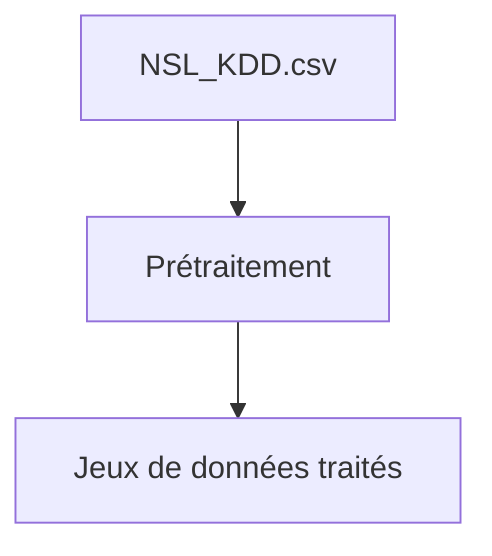

# Projet 1 — Prétraitement du jeu de données NSL-KDD

## Description

Ce projet a pour objectif le prétraitement du jeu de données NSL-KDD, couramment utilisé pour la détection d'intrusions réseau. Le prétraitement comprend : la gestion des valeurs manquantes, l'encodage des variables catégorielles, la normalisation des variables numériques et la séparation des données en ensembles d'entraînement et de test.

Le projet a été réalisé dans le cadre du cours « Méthodes avancées en cybersécurité basées sur l'intelligence artificielle » (enseignant : Mme Hajar Moudoud) à l'Université du Québec en Outaouais (UQO), Gatineau.

## Utilisation

- Environnement recommandé : Python 3.13.7
- Les dépendances sont listées dans `requirements.txt`. Il est conseillé d'installer ces dépendances dans un environnement virtuel (venv, conda) et de verrouiller (pinner) les versions si vous souhaitez reproduire exactement les résultats.
- Pour l'édition et l'exécution des notebooks, l'IDE recommandé est Visual Studio Code avec l'extension Jupyter et Data Wrangler qui permet une visualisation aisée des données.

## Fichiers importants

- Notebook principal : `main.ipynb`
- Sujet du projet : `Projet1_sujet.pdf`
- Rapport / compte-rendu : `Projet1_Pretraitement_ClementGauthier.pdf`
- Dépôt GitHub : <https://github.com/gogo25171/Projet1_Pretraitement>

## Données

Les données se trouvent dans le dossier `data/` :

- `data/Teacher/NSL_KDD.csv` — jeu de données principal utilisé pour le projet.
- `data/NSL-KDD-kaggle/` — copies de la version originale du dataset (fichiers `.arff` et `.txt`) utilisables si besoin.

Les jeux de données produits par le prétraitement sont enregistrés dans `data/Dataset_pre_traiter/` :

- À la racine de ce dossier : résultats du prétraitement pour l'exercice 10 (séparations `train` / `test`) .
- `data/Dataset_pre_traiter/first_part/` : fichiers CSV du premier prétraitement (`X_train.csv`, `X_test.csv`, `y_train.csv`, `y_test.csv`).

## Schéma d'architecture

## Auteur

- Clément Gauthier
