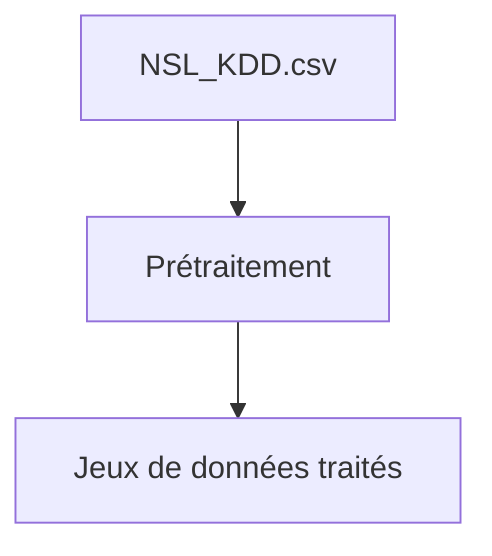

# Projet 1 — Prétraitement du jeu de données NSL-KDD

## Description

Ce projet a pour objectif le prétraitement du jeu de données NSL-KDD, couramment utilisé pour la détection d'intrusions réseau. Le prétraitement comprend : la gestion des valeurs manquantes, l'encodage des variables catégorielles, la normalisation des variables numériques et la séparation des données en ensembles d'entraînement et de test.

Le projet a été réalisé dans le cadre du cours « Méthodes avancées en cybersécurité basées sur l'intelligence artificielle » (enseignante : Mme Hajar Moudoud) à l'Université du Québec en Outaouais (UQO), Gatineau.

## Utilisation

1. Il faut que vous ayez Python installé sur votre machine, version recommandée : Python 3.13.7
2. Cloner le dépôt GitHub ou télécharger les fichiers.
3. Créer un environnement virtuel :

  ```bash
  python -m venv env
  ```

4. Entrer dans l'environnement virtuel :

- Sur Windows :

    ```bash
    .\env\Scripts\activate
    ```

- Sur macOS/Linux :

    ```bash
    source env/bin/activate
    ```

5. Installer les dépendances :

  ```bash
  pip install -r requirements.txt
  ```

6. Ouvrir le notebook `main.ipynb` dans un IDE compatible Jupyter (par exemple, Visual Studio Code), puis exécuter les cellules du notebook pour effectuer le prétraitement.

## Fichiers importants

- Notebook principal : `Projet1_Pretraitement_ClementGauthier.ipynb`
- Sujet du projet : `Projet1_sujet.pdf`
- Rapport / compte rendu : `Projet1_Pretraitement_ClementGauthier.pdf`
- Dépôt GitHub : <https://github.com/gogo25171/Projet1_Pretraitement>

## Données

Les jeux de données se trouvent dans le dossier `data/` :

- `data/Teacher/NSL_KDD.csv` — jeu de données principal utilisé pour le projet.
- `data/NSL-KDD-kaggle/` — copies de la version originale du dataset depuis Kaggle (fichiers `.arff` et `.txt`) utilisables si besoin.

Les jeux de données produits par le prétraitement sont enregistrés dans `data/Dataset_pre_traiter/` :

- À la racine de ce dossier : résultats du prétraitement pour l'exercice 10 (séparations `train` / `test`).
- `data/Dataset_pre_traiter/first_part/` : fichiers CSV du premier prétraitement (`X_train.csv`, `X_test.csv`, `y_train.csv`, `y_test.csv`).

## Schéma d'architecture



## Auteur

- Clément Gauthier
